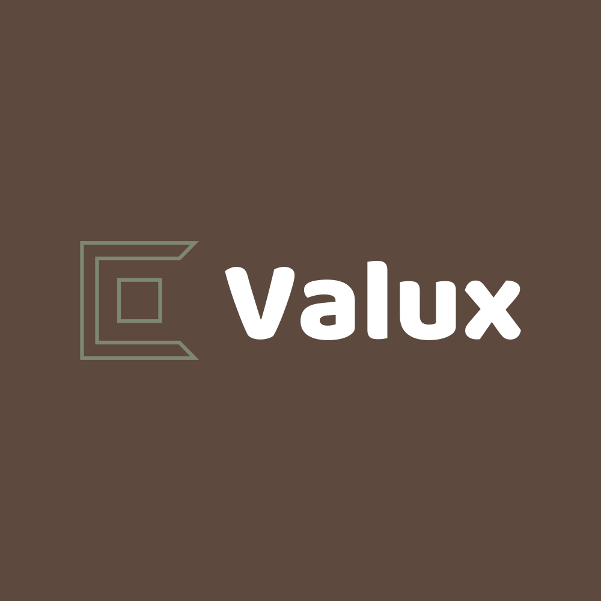

 
  

<h1 align="center">Valux Games</h1>

The Best Way To Play Game's In School

This Site Was Made By Valux

<h1 align="center">Features</h1>

- **Lots Of Games**
- **Retro Games**
- **Emulators**
- **Roblox Servers**

- **Tab Cloaking**
- **Prevent Page Close**
- **About:Blank Embeder**
- **Panic Button**
- **Proxies (Testing)**

- **Doesnt Have A Thousand Ads On Every Page (Or Will It?)**

<h1 align="Center">Instructions To Host Your Own</h1>

You Can Fork This Repo and Host Your Own But You Need To Include The Following

- **Link To The Original Site**
- **Credits**

Do Not Do The Following

- **Rebrand The Site As Your Own**

<h1 align="center">Contact Valux</h1>

Soon!

